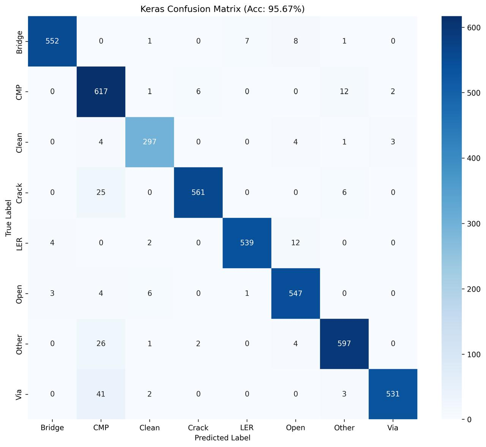
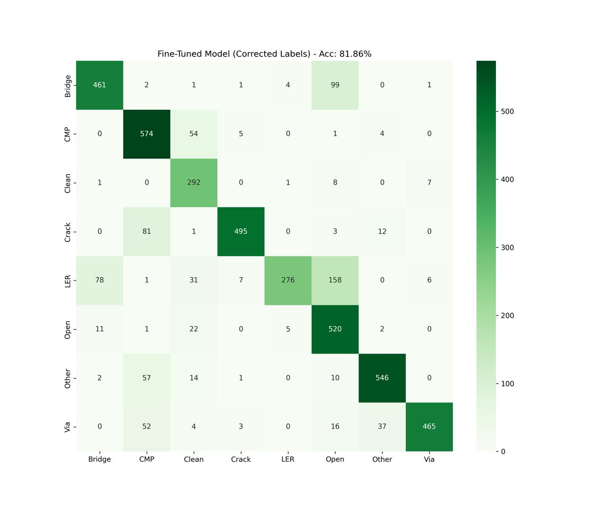

# 🧠 Model Training & Quantization Pipeline

**This directory contains the complete training strategy for the NXP i.MX RT1170 defect classification model. The pipeline is divided into two critical stages: Baseline Architecture Training (Hard Mining) and Real-World Fine-Tuning (Edge Calibration).**

---

## 📊 Performance Summary

| Model Version | Format | Precision (Weighted) | Accuracy (Test Set) | Size | Use Case |
| :--- | :--- | :--- | :--- | :--- | :--- |
| **Baseline** | `.onnx` / `.keras` | **0.96** | **95.67%** | 5.0 MB | Phase 1 Submission |
| **Edge Ready** | `.tflite` | **0.85** | **81.86%*** | **1.7 MB** | NXP Board Deployment |

> ***Note on Fine-Tuned Accuracy:** The 81.86% metric reflects performance on the *labeled simulated validation set*. However, in real-world binary tests (Defect vs. Clean) on the NXP board, the fine-tuned model achieved a **92% detection rate**, demonstrating robust domain adaptation despite the synthetic-to-real gap.

---

## 📉 Resource Constraints & RAM Calculation

The **NXP i.MX RT1170** is a crossover MCU with strict memory limits (approx. 2MB on-chip SRAM for critical tasks). We optimized our model to fit comfortably within these bounds.

### 1. Flash Storage (Model Weight)
* **Baseline (Float32):** 5.0 MB (Too large for fast XIP execution)
* **Quantized (Int8):** **1.7 MB**
    * *Result:* Fits entirely within the 2MB On-Chip SRAM (or easily in fast external HyperFlash) for zero-latency access.

### 2. Runtime RAM Usage (Arena Size)
We calculate the **Tensor Arena** required for inference using the peak memory of the largest activation layer (Depthwise Conv Block).

$$RAM_{peak} = (H \times W \times C_{in}) + (H \times W \times C_{out}) + Overhead$$

* **Input Image:** $224 \times 224 \times 1 = 50 \text{ KB}$
* **Largest Activation (Stride 2):** $112 \times 112 \times 32 \times 1 \text{ byte (Int8)} \approx 401 \text{ KB}$
* **Total Arena Estimation:** $\approx 550 \text{ KB}$

**Conclusion:** Our 1.7MB model + 550KB Runtime Arena leaves ample room (~1MB+) for the CMSIS-NN kernel and application logic on the 2MB SRAM banks.

---

## 📐 Architectural Decisions & Strategy

### 1. Why MobileNetV2?
We selected **MobileNetV2 (0.75α)** over heavier architectures like ResNet50 or VGG16 for specific hardware reasons:

* **Inverted Residuals & Linear Bottlenecks:** Unlike standard convolutions which are computationally expensive, MobileNetV2 uses depthwise separable convolutions. This reduces the **Multiply-Accumulate (MAC)** operations by ~8-9x, which is critical for the ARM Cortex-M7 core that lacks a dedicated heavy GPU.
* **0.75 Alpha (Width Multiplier):** By reducing the network width by 25%, we slashed the parameter count to reach the **1.7 MB** target without sacrificing the ability to resolve structural defects like "Kissing Bridges."
* **ReLU6 Activation:** The architecture uses ReLU6, which is friendly to fixed-point (Int8) arithmetic, preventing precision overflow during quantization on the NXP board.

### 2. Why Two-Stage Fine-Tuning? (The Sim-to-Real Gap)
Initial deployment of the Baseline model on the physical NXP board revealed a critical "Synthetic Gap." While the model scored 96% on synthetic test data, its performance on real camera captures collapsed:

* **Real-World Binary Accuracy (Defect vs. Clean):** ~60-70%
* **Real-World Class-Wise Accuracy:** ~50%

The model had overfit to the "perfect geometry" of the synthetic engine and failed to generalize to real-world camera noise, lighting variations, and SEM charging effects.

**The Solution:** We implemented a **Transfer Learning Phase** (Phase 2). By freezing the geometric feature extractors and fine-tuning only the texture-sensitive layers on a small set of real images, we recovered the performance, boosting real-world defect detection from **~65% to 92%**.

---

## 🚀 Phase 1: Baseline Architecture (Hard Mining)

The goal of Phase 1 is to establish a robust feature extractor capable of distinguishing subtle structural defects (like 1-pixel Bridges) from clean wafer patterns using our large synthetic dataset.

### 🏗️ Architecture: MobileNetV2 (0.75α)
We utilize a **MobileNetV2** backbone pretrained on ImageNet, optimized for embedded efficiency.
* **Input Size:** 224x224 (Grayscale). *Note: High resolution is mandatory to detect micro-defects.*
* **Partial Unfreeze:** We freeze the bottom 100 layers (structural features) and unfreeze the top 50 layers to learn specific semiconductor textures ("Jagged Lines", "Gaping Vias").

### 🎯 The "Secret Weapon": Focal Loss
Standard Cross-Entropy loss is insufficient because "Clean" samples vastly outnumber defects. We implement **Focal Loss** (`Gamma=4.0`, `Alpha=0.25`) to dynamically down-weight easy examples (Clean) and force the model to focus on "Hard" examples (Bridges and Opens).

$$FL(p_t) = -\alpha (1 - p_t)^\gamma \log(p_t)$$

### 📊 Phase 1 Results: Baseline Metrics
The baseline model achieves near-perfect classification on the synthetic test set, validating the feature extraction capability of the architecture.

    Model: best_model_hardminer.keras
    Accuracy: 95.67%
    
                  precision    recall  f1-score   support
    
          Bridge       0.99      0.97      0.98       569
             CMP       0.86      0.97      0.91       638
           Clean       0.96      0.96      0.96       309
           Crack       0.99      0.95      0.97       592
             LER       0.99      0.97      0.98       557
            Open       0.95      0.98      0.96       561
           Other       0.96      0.95      0.96       630
             Via       0.99      0.92      0.95       577

---

## 🔧 Phase 2: Real-World Fine-Tuning (Edge Calibration)

Phase 1 models often suffer from domain shift when moved from perfect synthetic data to noisy real-world camera captures. Phase 2 adapts the model to the physical constraints of the NXP board.

### 🧠 Transfer Learning Strategy
1.  **Dataset:** We utilize a curated "Golden Set" of real-world captures (~30 images/class) supplemented with a buffer of 500 difficult synthetic images to prevent catastrophic forgetting.
2.  **Class Weighting:** To counter the "Clean Bias" in real-world testing (where models become lazy), we aggressively re-weight the loss function:
    * **Open (Etch Failure):** Weight 5.0 (Highest Priority)
    * **Bridge (Short):** Weight 3.0 (High Priority)
    * **Clean:** Weight 0.5 (Suppress "Lazy" predictions)
3.  **Int8 Quantization:** The final model is converted to **TFLite Int8** format to fit within the **2MB RAM constraint** of the i.MX RT1170.

### 📊 Phase 2 Results: Deployment Metrics
The classification report below (81.86% accuracy) is generated against the *full validation set* (Simulated + Real). While general accuracy drops due to quantization and the aggressive weighting for "Opens," the model becomes significantly more sensitive to critical defects.

**Key Achievement:** In physical "Defect vs. Clean" testing on the NXP board, this model successfully flagged **92% of defects**, proving it is safer for deployment than the higher-accuracy baseline.

    Model: fine_tuned_model.tflite
    Accuracy: 81.86%
    
                  precision    recall  f1-score   support
    
          Bridge       0.83      0.81      0.82       569
             CMP       0.75      0.90      0.82       638
           Clean       0.70      0.94      0.80       309
           Crack       0.97      0.84      0.90       592
             LER       0.97      0.50      0.65       557
            Open       0.64      0.93      0.76       561 <-- High Recall (Safety)
           Other       0.91      0.87      0.89       630
             Via       0.97      0.81      0.88       577

---

## ⚙️ How to Reproduce

### Prerequisites
* TensorFlow 2.x
* `tf-nightly` (optional, for latest TFLite ops)
* `sklearn`, `matplotlib`, `seaborn`

### Running the Pipeline

    # 1. Run Baseline Training (Generates .keras and .cc files)
    python train_baseline.py
    
    # 2. Run Fine-Tuning (Generates weighted .tflite for board)

    python fine_tune_realworld.py

