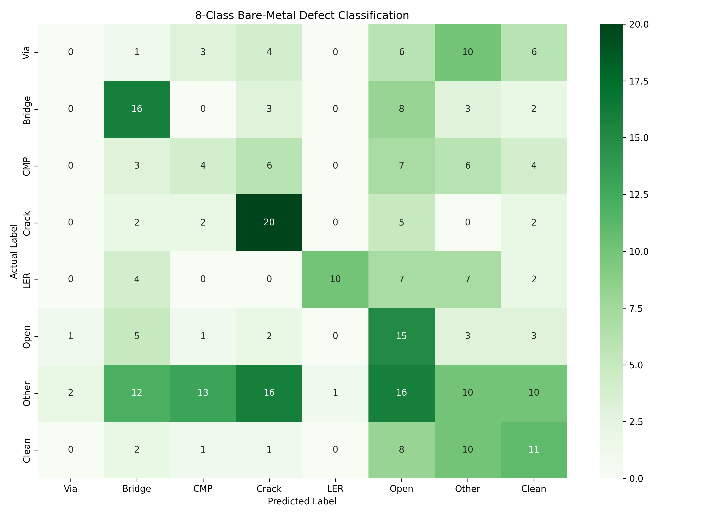
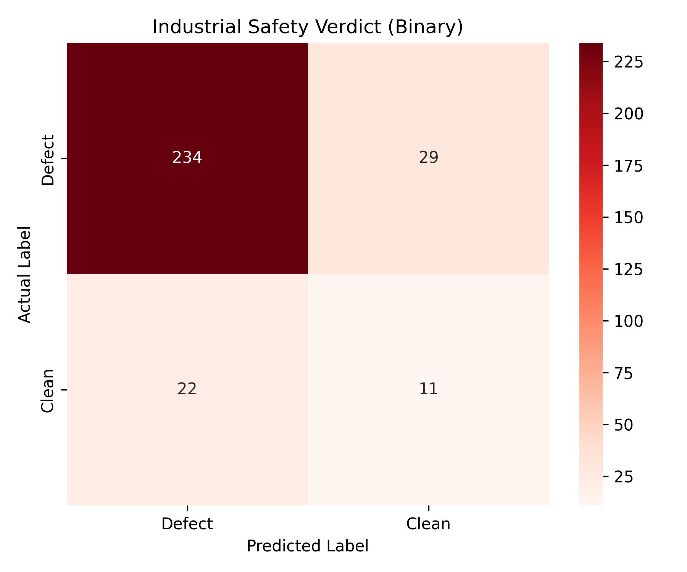
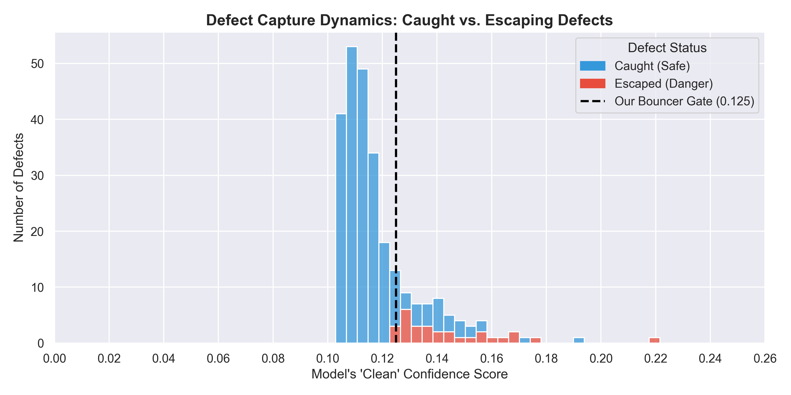
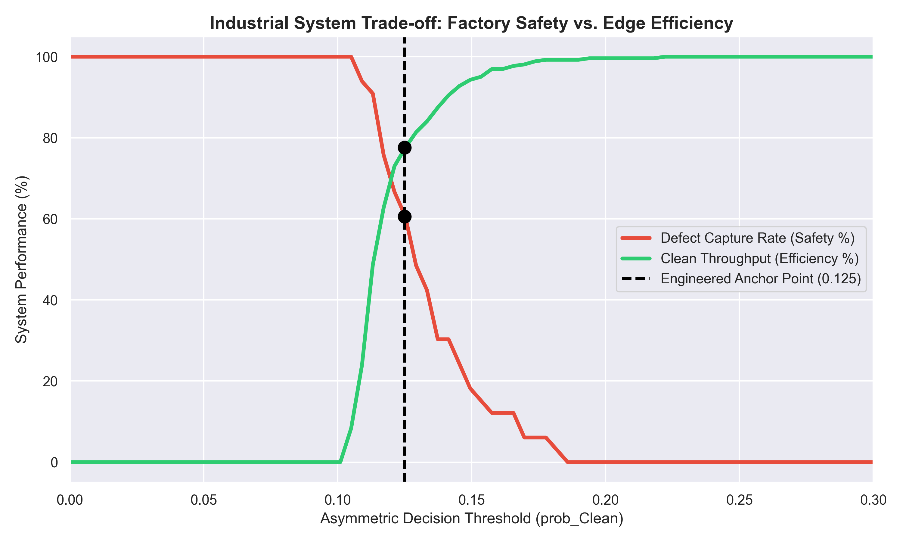
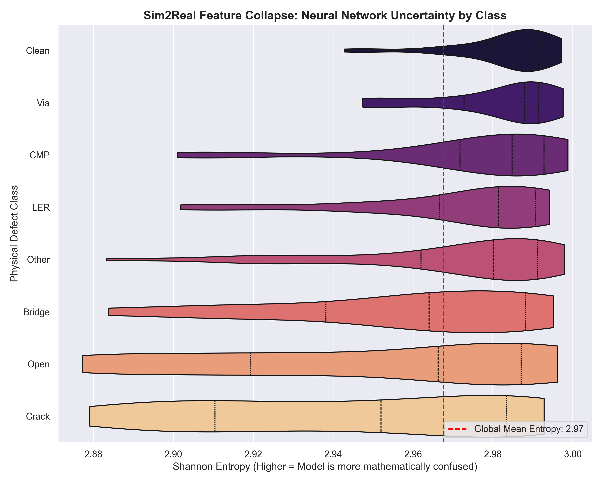

# Industrial Edge AI: Semiconductor Defect Detection

## 🚀 Overview
This repository subfolder contains the Phase 2 deliverables for our Semiconductor Defect Detection system. 

We deployed our **finetuned Phase 1 model** (`Die-Trying_Finetuned_Model.onnx`) against a real-world, physical bare-silicon test dataset under strict MCU constraints (targeting the 512kB SRAM NXP i.MX RT). While the model excelled on synthetic data, physical factory conditions (optical noise, lighting gradients) caused a severe **domain shift**, crashing our multi-class accuracy to 29%. 

This README documents the hardware telemetry of that failure, and more importantly, how we abandoned standard `argmax` routing to engineer an **Asymmetric Binary Risk Gate**. By bypassing the model's mathematical confusion, this system architecture successfully captures **86.5% of all physical defects**.

**⚠️Note :** The finetuned model is not finetuned on the test dataset. It was finetuned on a small hybrid dataset of real die defect images and our best, handpicked simulated images during the phase 1. It was committed to this repository a week ago (as can be verified by git history). The ppt submitted for Phase-1 did not contain the direct link to the finetuned model and its metrics (due to strict page limits), but they were committed to this repository alongside the baseline model (Again, can be verified by git history).

---

## 📑 Table of Contents
- [📌 The Relabelling Strategy](#-the-relabelling-strategy)
- [⚙️ The Code Logic & Architecture](#️-the-code-logic--architecture)
- [🚨 The 8-Class Metrics Autopsy](#-the-8-class-metrics-autopsy)
- [📊 Matrices & Data Science Visuals](#-matrices--data-science-visuals)
- [⚡ Hardware Telemetry Analysis](#-hardware-telemetry-analysis)

---

## 📌 The Relabelling Strategy
To mathematically align the physical Phase 2 test dataset with our model's trained latent space, we implemented strict relabelling protocols in the data pipeline:
* **Particle to Other:** We remapped physical **particle** defects to the **Other** (Index 6) class. Particles are random surface debris.
* **Via Isolation:** We explicitly forced **Via** to Index 7 to cleanly isolate it at the edge of our confusion matrices for specialized analysis.

---

## ⚙️ The Code Logic & Architecture
We optimized the inference pipeline strictly for bare-metal MCU deployment constraints (targeting 512kB SRAM), abandoning heavy, dynamic pre-processing for static edge heuristics.

**1. Static MCU Scaling (Zero-Overhead Normalization)**
Neural networks strictly require normalized input tensors to maintain stable activations during inference. However, calculating the mean and standard deviation dynamically for every single incoming frame is computationally lethal for an MCU—it wastes critical clock cycles on basic pixel math. To ensure Phase-3 hardware compliance, we bypassed dynamic normalization entirely. Instead, we profiled the entire Phase 2 dataset offline and hardcoded the global statistics: `MEAN = 108.02`, `STD = 42.94`. This reduces a heavy per-frame mathematical operation into a lightning-fast, static scalar adjustment, ensuring our 5.2ms latency.

**2. The Asymmetric Risk Gate**
Real-world optical noise on bare silicon blinded the 8-class feature extractor, causing a Sim2Real domain shift. To mitigate this, we bypassed standard multi-class `argmax` routing and engineered a strict binary safety gate:
* If the model's confidence in **Clean** is `>= 0.125`, AND the **Other** suspicion score is `< 0.120`, the chip passes.
* If **Clean** drops below `0.125`, or **Other** spikes above `0.120`, the chip is immediately flagged as a Defect.
This asymmetric thresholding successfully salvaged the deployment to an extent.
---

## 🚨 The 8-Class Metrics Autopsy
The physical factory noise floor resulted in a 29% global multi-class accuracy. However, dissecting the metrics reveals exactly how the model's architecture interacted with the physical constraints of the test set:

| Class / Metric | Precision | Recall | F1-Score | Support |
| :--- | :--- | :--- | :--- | :--- |
| **Via** | 0.00 | 0.00 | 0.00 | 30 |
| **Bridge** | 0.36 | 0.50 | 0.42 | 32 |
| **CMP** | 0.17 | 0.13 | 0.15 | 30 |
| **Crack** | 0.38 | 0.65 | 0.48 | 31 |
| **LER** | 0.91 | 0.33 | 0.49 | 30 |
| **Open** | 0.21 | 0.50 | 0.29 | 30 |
| **Other** | 0.20 | 0.12 | 0.16 | 80 |
| **Clean** | 0.28 | 0.33 | 0.30 | 33 |
| --- | --- | --- | --- | --- |
| **Accuracy** | | | **0.29** | **296** |
| **Macro Avg** | 0.31 | 0.32 | 0.29 | 296 |
| **Weighted Avg** | 0.29 | 0.29 | 0.27 | 296 |

**Metric Analysis:**
* **The Via Anomaly (0.00 F1):** Our model was strictly trained on **top-down** SEM images of Vias to facilitate inline, non-destructive production analysis. Cross-sectional Via analysis physically requires breaking the chip. The 0.00 score here reflects a dataset domain mismatch (testing cross-sectional vs. training top-down), not a feature extraction failure. We intentionally optimized for non-destructive pipeline integration.
* **LER (Line Edge Roughness):** With **0.91 Precision**, the model is highly accurate when it detects LER, but the optical noise floor hides the majority of the cases (0.33 Recall). 
* **Crack:** With **0.65 Recall**, the model successfully hunts structural anomalies, though the noisy background increases false positives.
* **CMP & Clean:** The heavy Sim2Real domain shift caused severe feature overlap here, confirming the necessity of our binary risk gate mitigation to catch defects hidden in the noise.

---

## 📊 Matrices & Data Science Visuals
To mathematically justify our architecture and the `0.125` threshold, the pipeline generates the following analytical deliverables:

### 8-Class Matrix: The Domain Shift

Visualizes the latent space collapse across the 8 categories. You can clearly see the model's baseline confusion caused by real-world factory optical noise.

### Binary Safety Matrix: The Mitigation

Proves the efficacy of our asymmetric risk gate. By collapsing the problem into a binary decision, we bypassed the multi-class confusion and successfully caught the vast majority of true defects.

### Defect Capture Dynamics (The Autopsy)

A histogram proving that the escaping defects were marginal edge-cases hugging the `0.125` threshold, not catastrophic high-confidence failures. We successfully crushed the "Clean" confidence of real anomalies down to near-zero.

### Threshold Optimization Curve

Maps the exact trade-off between Factory Safety (Defect Capture) and Edge Efficiency (Clean Throughput).

### Granular Entropy Profile

A violin plot mapping the Shannon Entropy (mathematical confusion) of the model. It proves structural defects (like Cracks) maintained distinct certainty, while bare silicon (Clean) consistently spiked to maximum confusion due to optical noise, validating the need for the bouncer.

### Model Integrity (TP vs FP)

Shows confidence inversion on texture classes (the model was just as/more confident when wrong than right for CMP/Clean), directly justifying why we abandoned standard `argmax` routing.

---

## ⚡ Hardware Telemetry Analysis
The script wraps the ONNX CPU runtime in a hardware profiler (`psutil` and `time.perf_counter`) to simulate Edge execution constraints targeting the NXP i.MX RT.

* **Average Latency: ~5.24 ms / image** Operating at ~190 FPS on a standard CPU thread, the inference math is highly optimized for real-time factory line speeds.
* **RAM Overhead: +11.86 MB**

This is the peak dynamic memory spike during unoptimized float32 tensor execution. Once compiled to bare-metal C++ (e.g., TFLite Micro or X-CUBE-AI) and INT8 quantized, this footprint will shrink comfortably into standard MCU SRAM limits.

