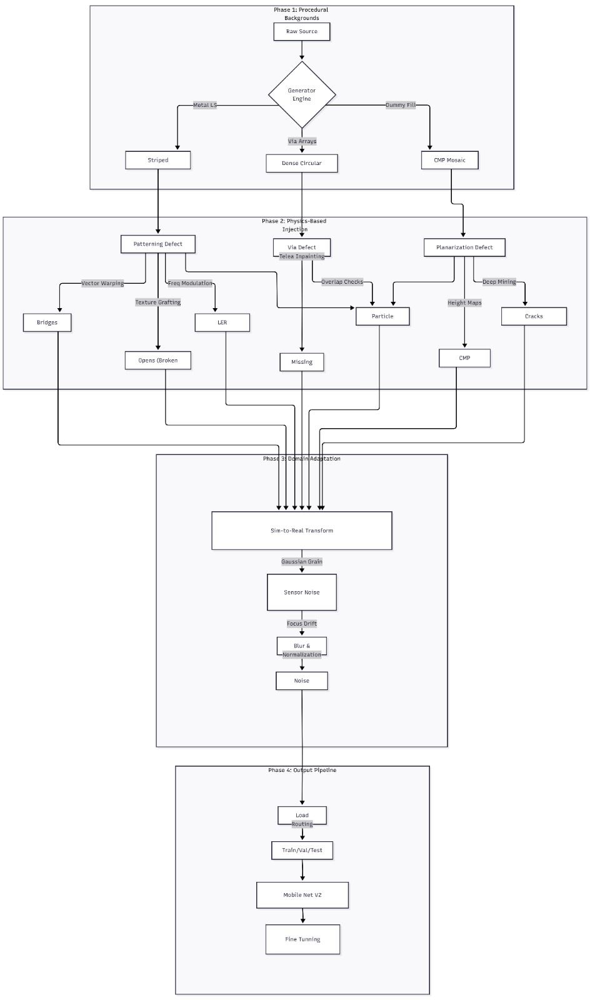

# 🏭 NXP-Defect-Synth: Physics-Aware Synthetic Data Engine

**A procedural computer vision pipeline for generating photorealistic semiconductor defect datasets for Edge AI training.**

## 📖 Project Overview

**NXP-Defect-Synth** solves the critical "Data Bottleneck" in Automated Optical Inspection (AOI). Real-world semiconductor defect data is proprietary, scarce, and highly imbalanced. To train robust Edge AI models for the **NXP i.MX RT1170**, we built a hybrid synthetic data engine that generates thousands of photorealistic SEM (Scanning Electron Microscope) images with pixel-perfect ground truth.

Unlike standard GANs (which **hallucinate artifacts**), our pipeline uses **procedural physics simulation**—modeling resist collapse, etch failure, and electron charging—to create physically accurate training data.

---

## 🏗️ The Pipeline Architecture

Our engine operates in four distinct phases, moving from procedural geometry to domain-adapted realism.



---

## 🔬 Technical Deep Dive

### Phase 1: Procedural Backgrounds
We simulate three standard wafer environments using randomized tiling and rotation logic (`Clean_Gen.py`):
* **Metal LS:** Rotatable, striped interconnects.
* **Via Arrays:** Dense, repetitive circular patterns with scale randomization.
* **Dummy Fill:** Complex mosaic tiling used for CMP planarization.

### Phase 2: Physics-Based Injection
We don't just draw white boxes. We simulate the formation of defects:

#### ⚡ Patterning Defects
* **Bridges (Shorts):** Implements a **"Kissing Line" Algorithm** (`Bridge_Gen.py`) that uses vector fields to warp two parallel lines until they touch, preserving anti-aliasing and noise profiles.
* **Opens (Etch Failure):** Uses **Texture Grafting** (`Open_Gen.py`) to blend real "gap texture" into metal lines, simulating a clean copper break.
* **Line Edge Roughness (LER):** Applies **Frequency Modulation** (`LER_Gen.py`) to edges, creating "bumpy" lithography artifacts without breaking connectivity.

#### 🕳️ Via & Surface Defects
* **Missing Vias:** Uses **Telea Inpainting** (`Vias_Gen.py`) to "heal" an existing via, blending it with background noise to create a realistic filled hole.
* **Particles:** Simulates **SEM Charging Effects** (`Other_Gen.py`)—the bright halo seen around organic particles in electron microscopes—using distance transforms.
* **CMP Scratches:** Generates organic "puddle" shapes using height-map shading to simulate depth (`Planarization_Defects_Gen.py`).

### Phase 3: Sim-to-Real Domain Adaptation
To prevent the "Synthetic Gap," we corrupt our perfect data to match real Fab conditions (`Build_Final_Dataset.py`):
1.  **The Noise Equalizer:** We heavily augment clean images with Salt-and-Pepper noise. This forces the AI to learn structural features rather than associating "noise" with "defects."
2.  **Optics Simulation:** Applies Gaussian blur (focus drift) and Vignetting (SEM column shading).

---

## 📂 Dataset Structure

The pipeline outputs raw data into a staging directory and then compiles it into a `Final_Dataset_v2` ready for training.

### 1. Staging (Raw Output)
Contains paired images and labels for debugging and manual inspection.

    Staging_Dataset/
    ├── Bridge/
    │   ├── Images/
    │   └── Labels/
    ├── Clean/
    ... (All Generator Classes)

---

### 2. Final Training Set (`Final_Dataset`)
The `Build_Final_Dataset.py` script automatically balances classes and splits data using a **70% / 20% / 10%** ratio.

* **Link to the dataset:** https://drive.google.com/file/d/1aESAhJMB3ur3kpgqoUetGvQf6l2wuAiW/view?usp=drive_link
* **Total Images:** 22.5k+
* **Resolution:** 224x224 (Grayscale)
* **Split Strategy:**
    * **Train (70%):** For model weight optimization.
    * **Validation (20%):** For hyperparameter tuning and early stopping.
    * **Test (10%):** Held-out set for final NXP board performance benchmarks.

```text
    Final_Dataset/
    ├── Train/
    │   ├── Bridge/
    │   ├── Clean/
    │   ├── CMP/
    │   ├── Crack/
    │   ├── LER/
    │   ├── Open/
    │   ├── Other/
    │   └── Via/
    ├── Validation/
    │   └── (Same 8 classes)
    └── Test/
        └── (Same 8 classes)
```

---

## 🔬 Real-World Validation Set (`Real_Dataset`)

To ensure our synthetic pipeline generalizes to actual factory conditions, we curated a specialized **Real_Dataset** used exclusively for final calibration and out-of-distribution testing.

### 📊 Dataset Composition
* **Link to the dataset:** https://drive.google.com/file/d/14djOtTxtCsFTsXlKKSK-zw37H1nIHyz9/view?usp=drive_link
* **Total Samples:** 240 high-resolution captures.
* **Domain Authentic Data:** Includes **~90 raw SEM captures** from real semiconductor wafers, providing the ultimate benchmark for model robustness.
* **Purpose:** This set acts as the "Ground Truth" for domain adaptation. While the model trains on 22.5k synthetic images, its deployment readiness is measured by its ability to classify these real-world variations.

### 🧪 Sim-to-Real Performance Gap
Initial testing revealed that models trained purely on synthetic data struggled with real-world sensor noise. By using this **Real_Dataset** as a buffer during Phase 2 Fine-Tuning, we achieved:
* **Synthetic Test Accuracy:** 95.67%
* **Real-World Defect Detection:** **92%** (Binary Defect vs. Clean classification on the NXP board).

---

## 🚀 Usage

### Prerequisites

    pip install opencv-python numpy scipy pyyaml tqdm

### Running the Pipeline
To generate a full dataset from scratch:

    # 1. Mine real textures (Optional)
    python Carinthia_Scratch_Chop.py

    # 2. Generate Base Clean Backgrounds
    python Clean_Gen.py

    # 3. Inject Defects (Run in parallel)
    python Bridge_Gen.py
    python Crack_Gen.py
    python CMP_Dummy_Fill_Gen.py
    python LER_Gen.py
    python Vias_Gen.py

    # 4. Assemble, Split (70/20/10), and Normalize Final Dataset
    python Build_Final_Dataset.py

---

## 🏆 Why This Matters
* **Privacy:** No proprietary fab data is required.
* **Balance:** We generate 2,500 images per class, solving the "Rare Defect" problem.

* **Edge-Ready:** Data is specifically tuned (**224x224 grayscale**) for efficient inference on embedded NXP targets.


